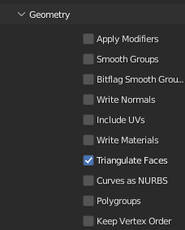
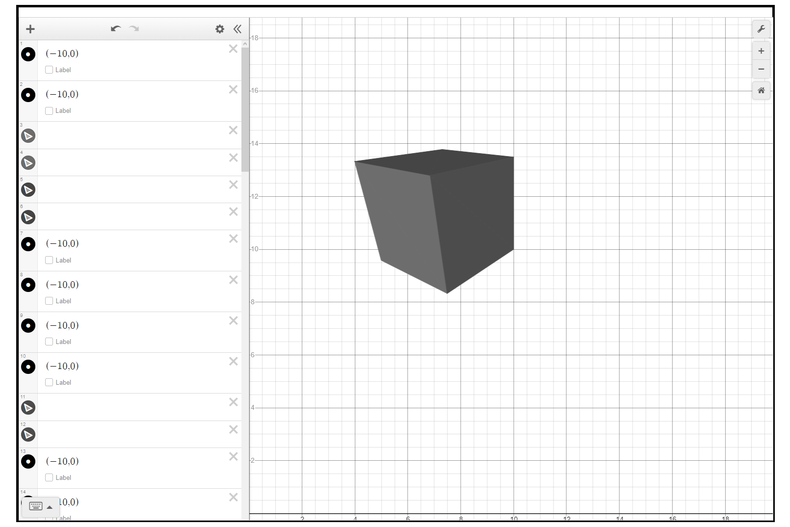
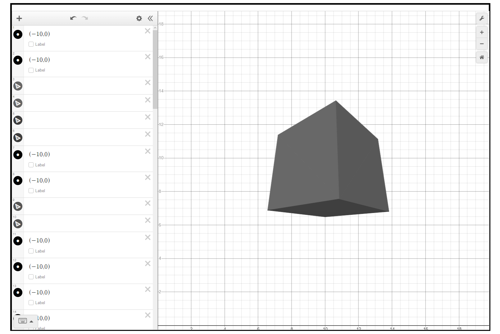

# Desmos 3D Renderer
 Renders 3D models in the Desmos Graphing Calculator!
 There is a version of this at [this link](https://stupidjuice.github.io/apps/Desmos3DRenderer/) if you want to play with it! (It will be outdated to the current version because I don't feel like updating the website every time I add a new feature

## Custom Model Instructions

The file upload at the bottom of the web page allows you to upload custom .obj files to render.
When exporting the .obj file from Blender (I recommend exporting from Blender), you must unselect everything from the geometry tab except "Triangulate Faces"
\

## Example Images

wow such awesome

OMG ITS AT A DIFFERENT ANGLE

#### Credits
I copied and pasted a bunch of code from [this repo](https://github.com/OneLoneCoder/Javidx9/tree/master/ConsoleGameEngine/BiggerProjects/Engine3D) by OneLoneCoder. Please check it out!
